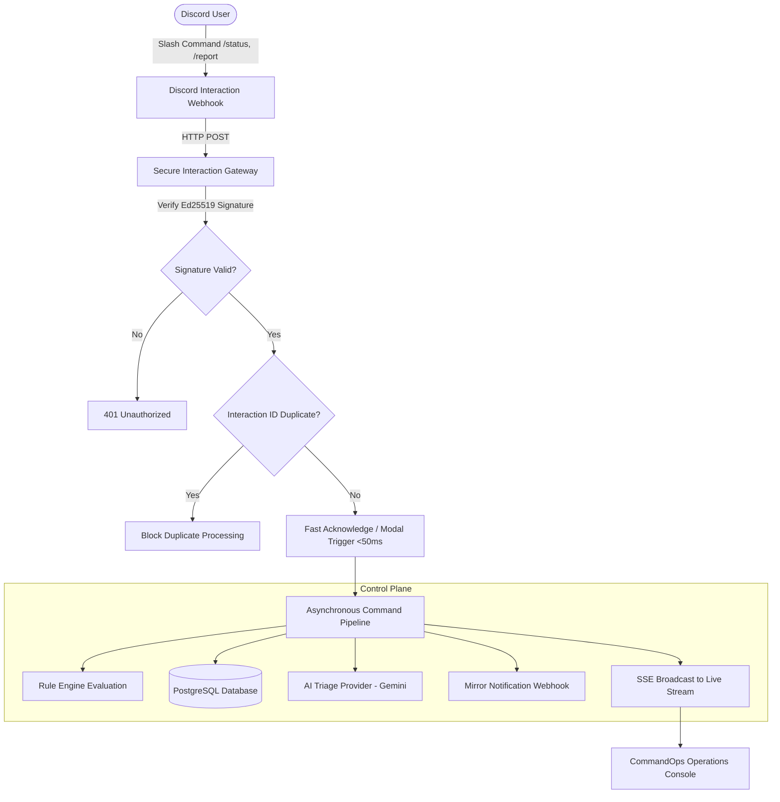

# CommandOps — Discord Command Operations Center

> **Tagline**: *"Discord is the interface. CommandOps is the control plane."*

CommandOps is an enterprise-grade operational control plane and Discord command gateway built for modern DevOps, SRE, and Incident Response teams. It bridges Discord slash commands directly into an audited, rule-evaluated, AI-triaged operational control plane.

---

## 📐 Architecture Overview



---

## 🧰 Technology Choices

- **Frontend**: Next.js 15 (App Router), React 19, TypeScript, Tailwind CSS, Lucide Icons, Server-Sent Events (SSE).
- **Backend & Gateway**: Next.js API Routes, Node.js runtime, Ed25519 verification (`tweetnacl`), JWT authentication (`jose`), Password hashing (`bcryptjs`).
- **Database & ORM**: PostgreSQL database, Prisma ORM (migrations + seed scripts).
- **AI Triage**: Google Gemini API (`@google/generative-ai`) with deterministic Fallback Heuristic AI Provider.
- **Testing**: Vitest suite covering security signatures, idempotency, rule engine, AI isolation, and dispatcher.

---

## 🔑 Evaluator Credentials & Demo Mode

For immediate candidate evaluation without setting up external Discord bot tokens or PostgreSQL databases:

- **Admin Login URL**: `http://localhost:3000/login`
- **Email**: `admin@commandops.io`
- **Password**: `admin_password_123!`
- **Interactive Command Simulator**: Click **"Run Simulator"** in the header to execute `/status` or submit a `/report` modal right inside the UI!

---

## ⚡ Quickstart & Local Setup

### 1. Prerequisites
- Node.js >= 18
- npm >= 9
- PostgreSQL (or Docker for `docker-compose`)

### 2. Clone & Install Dependencies
```bash
git clone https://github.com/your-username/commandops.git
cd commandops
npm install
```

### 3. Configure Environment
```bash
cp .env.example .env
```

### 4. Database Setup & Migrations
Start local PostgreSQL via Docker Compose (optional if using local Postgres):
```bash
docker-compose up -d
```
Generate Prisma client and seed sample data:
```bash
npx prisma generate
npm run db:push
npm run db:seed
```

### 5. Start Development Server
```bash
npm run dev
```
Open [http://localhost:3000](http://localhost:3000) in your browser.

---

## 🤖 Discord Application & Bot Registration

To connect CommandOps to a live Discord Guild:

1. Go to the [Discord Developer Portal](https://discord.com/developers/applications) and create an application.
2. Copy your **Application ID**, **Public Key**, and **Bot Token** into `.env`:
   ```env
   DISCORD_CLIENT_ID="your_client_id"
   DISCORD_PUBLIC_KEY="your_64_hex_public_key"
   DISCORD_BOT_TOKEN="Bot your_bot_token"
   ```
3. Set your **Interactions Endpoint URL** in the Discord Portal to:
   `https://your-domain.com/api/discord/interactions`
4. Register the slash commands (`/status` and `/report`) automatically:
   ```bash
   npm run discord:register
   ```

---

## 🧪 Testing Suite

Run the comprehensive Vitest test suite:

```bash
npm test
```

### Covered Tests:
1. Valid Ed25519 signature verification.
2. Invalid & missing signature rejection (401).
3. Discord PING/PONG handling.
4. Duplicate interaction ID protection (Idempotency).
5. Slash command routing (`/status`, `/report`).
6. Rule Engine condition evaluation and action pipeline execution.
7. AI Provider fallback strategy.

---

## 🛡️ Security & Reliability Model

- **Ed25519 Cryptographic Verification**: Every request to the interaction gateway must pass Ed25519 signature validation.
- **Idempotency Guarantee**: `interaction_id` is persisted with a `UNIQUE` database constraint. Duplicate deliveries are blocked.
- **3-Second Discord Constraint**: Commands return an initial fast path acknowledgment or modal trigger within <50ms.
- **Advisory AI Isolation**: AI triage is advisory only. Rule engine policies remain the deterministic source of truth.
- **Bounded Retry Backoff**: Webhook mirror deliveries execute exponential backoff up to 3 attempts. Failed deliveries enter the **Failure Center** for 1-click manual retry.

---

## 🚀 Deployment Instructions

- **Frontend & Backend**: Deploy to [Vercel](https://vercel.com) or [Render](https://render.com).
- **Database**: Use [Neon PostgreSQL](https://neon.tech) free tier. Set `DATABASE_URL` in environment variables.

---

## 📁 Repository Documentation

- [`ARCHITECTURE.md`](ARCHITECTURE.md): System architecture and data flow.
- [`SECURITY.md`](SECURITY.md): Threat model and security controls.
- [`AI_NOTES.md`](AI_NOTES.md): Honest documentation of AI usage during development.
- [`docs/decisions/`](docs/decisions/): Architectural Decision Records (ADRs).
